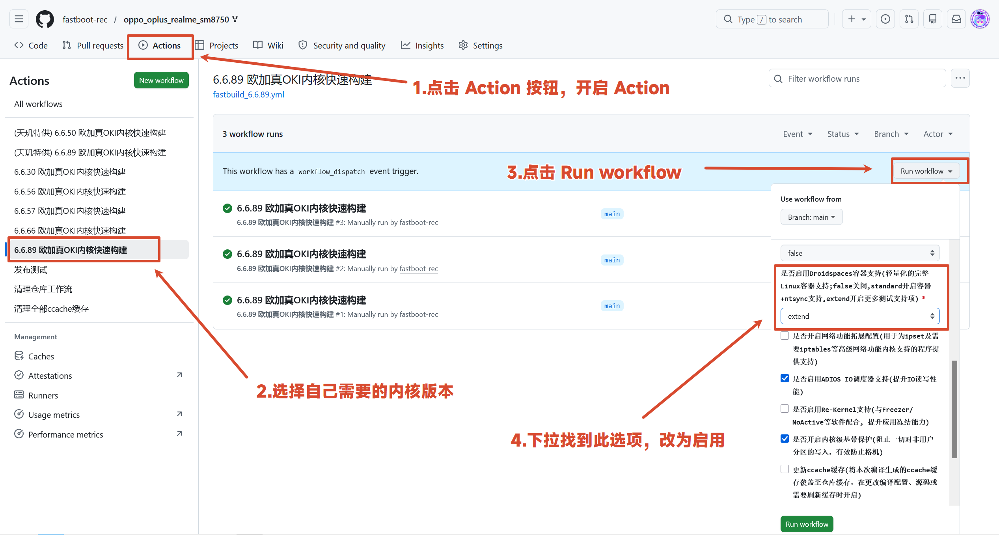

# 在一加设备上运行 Droidspaces

## 写在开头

> 本教程结合了AI内容，目的在于帮助读者知道如何在一加设备上完整运行 Droidspaces 并顺利在容器中调用原生 CPU 和 GPU 。
> 教程较为简略，更多的是为了自己的记忆
> 用到的项目如下
> Droidspaces 主项目：[ravindu644/Droidspaces-OSS](https://github.com/ravindu644/Droidspaces-OSS)
> Adreno GPU Mesa for Android Container：[lfdevs/mesa-for-android-container](https://github.com/lfdevs/mesa-for-android-container)
> 一加 SM8750（Snapdragon 8 Elite）内核：[cctv18/oppo_oplus_realme_sm8750](https://github.com/cctv18/oppo_oplus_realme_sm8750)
> 一加 SM8650（Snapdragon 8 Gen 3）内核：[cctv18/oppo_oplus_realme_sm8650](https://github.com/cctv18/oppo_oplus_realme_sm8650)

## 教程

### 内核编译

在内核方面，我选择使用来自 [cctv18/oppo_oplus_realme_sm8650](https://github.com/cctv18/oppo_oplus_realme_sm8650) 和 [cctv18/oppo_oplus_realme_sm8750](https://github.com/cctv18/oppo_oplus_realme_sm8750) 的项目，这个项目可以使用 GitHub Action 云编译，并且完整的做到了 Droidspaces 的适配

如何编译请看图片


### 配置中文环境

```bash
# 安装 locale 支持
apt install -y locales

# 交互式启用 zh_CN.UTF-8
dpkg-reconfigure locales

# 安装中文字体（Noto CJK + 文泉驿）
apt install -y fonts-noto-cjk fonts-wqy-zenhei fonts-wqy-microhei xfonts-wqy
```

### 配置非 root 用户

```bash
# 创建用户（按提示设密码、全名等信息）
adduser droid

# 加入 sudo 组
usermod -aG sudo droid
```

### Adreno GPU Mesa for Android Container 安装

1. 从“[releases](https://github.com/lfdevs/mesa-for-android-container/releases)”部分下载安装包。请注意文件名中的 Linux 发行版后缀，例如 debian_trixie_arm64。您只能安装与您的发行版匹配的软件包。
2. 将安装包直接解压到根目录。

    ```bash
    sudo tar -zxvf mesa-for-android-container*.tar.gz -C /
    ```

3. 刷新动态链接器缓存。

    ```bash
    sudo ldconfig
    ```

### Termux X11 Turnip (Native Qualcomm/Adreno)

对于高通Adreno GPU，Droidspaces支持使用Turnip驱动实现原生硬件加速。这绕过了对virgl的需求，提供了接近原生的性能表现。

要求

- 推荐Rootfs：使用官方构建仓库中的[Base/XFCE](https://github.com/ravindu644/Droidspaces-rootfs-builder/releases/latest) tar包。
- Termux：执行 `pkg install x11-repo && pkg install termux-x11`

实施步骤

1. 安装系统镜像：通过Droidspaces应用下载并安装兼容的rootfs文件系统。
2. 启用GPU访问：在容器设置中开启GPU访问和Termux X11功能。
3. 配置显示设置：将`DISPLAY=:0`添加到环境变量中。
4. 启动流程：
   - 通过Droidspaces启动容器。
   - 打开Termux并运行`termux-x11 :0`命令。
5. 权限管理（非root用户）：如果使用的是非root用户，需为其授予GPU设备节点的访问权限：
    `sudo usermod -aG droidspaces-gpu <your_username>`
6. 启动桌面环境：要启动完整的XFCE桌面（需已安装），请运行：
    `dbus-launch --exit-with-session startxfce4`

### 验证 CPU 是否原生调用

1. 查看 CPU 信息是否与宿主机完全一致

```bash
cat /proc/cpuinfo | grep "model name\|CPU implementer\|CPU architecture\|processor"
```

判断标准：

- 你应该看到 骁龙 8 Elite 的真实核心信息（如 `CPU implementer : 0x41`，`CPU architecture: 8` 或 `9` 等）。
- `processor` 数量应等于你设备的物理核心数（如 8 核）。
- 如果看到类似 `QEMU Virtual CPU` 或核心数/型号不对，说明不是原生。

### 验证 GPU 是否原生调用

这是你最需要验证的部分。Droidspaces 声称使用 **Turnip 驱动** 实现原生 Adreno GPU 调用，而不是 `virglrenderer` 或软件渲染。

#### 1. 安装诊断工具

```bash
apt install -y mesa-utils vulkan-tools glmark2
```

#### 2. 检查 OpenGL 渲染器

```bash
glxinfo -B | grep -i "renderer\|vendor\|OpenGL version"
```

**原生 GPU 的正确输出应类似**：

```bash
    Vendor: Mesa/X.org
    Renderer: Adreno (TM) 830   <-- 你的骁龙 8 Elite GPU 型号
    OpenGL version: 4.6 (Compatibility Profile) Mesa 24.x.x
```

**如果输出是以下之一，说明不是原生**：

- `llvmpipe` → 纯 CPU 软渲染，性能极差
- `virgl` / `virglrenderer` → 虚拟化中转，有性能损耗
- `softpipe` / `swrast` → 软件渲染

#### 3. 检查 Vulkan 渲染器

```bash
vulkaninfo --summary | grep deviceName
```

**原生 GPU 应显示**：

```bash
deviceName        = Adreno (TM) 830
```

如果显示 `llvmpipe` 或 `Virtio-GPU`，则不是原生。

### 4. 如果测试发现不是原生 GPU

可能原因及解决：

| 现象 | 原因 | 解决 |
| ------ | ------ | ------ |
| 显示 `llvmpipe` | Droidspaces 未开启 GPU Access | 在 Droidspaces App → 容器设置 → 开启 **GPU Access** |
| 显示 `virgl` | 使用了虚拟化驱动而非 Turnip | 检查是否安装了 `mesa-vulkan-drivers`（Turnip 属于 Mesa） |
| `/dev/dri` 不存在 | 内核缺少 DRM 支持 | 需要确认刷入的 Droidspaces 内核补丁包含 Adreno DRM |
| Vulkan 检测不到 | 缺少 Vulkan Loader | `apt install mesa-vulkan-drivers vulkan-icd-loader` |

**建议**：先在容器里跑 `glxinfo -B`，只看 `Renderer` 那一行，一秒钟就能判断 GPU 是不是原生。如果是 `Adreno (TM) 830`，恭喜你，确实是零损耗原生 GPU 调用。

### CPU 和 GPU 是否原生最简单的办法

```bash
sudo apt install fastfetch
fastfetch
```

看输出结果是否类似下面

```bash
root@debian:~# fastfetch
        _,met$$$$$gg.          root@debian
     ,g$$$$$$$$$$$$$$$P.       -----------
   ,g$$P""       """Y$$.".     OS: Debian GNU/Linux 13 (trixie) aarch64
  ,$$P'              `$$$.     Host: Qualcomm Technologies, Inc. Sun MTP,amg
 ,$$P       ,ggs.     `$$b:    Kernel: Linux 6.6.89-android15-8-g29d86c5fc9dd-abogki428889875-4k
 $P"'   .    $$$
 $$P      d$'     ,    $$P     Uptime: 1 day, 12 hours, 47 mins
 $$:      $$.   -    ,d$$'     Packages: 822 (dpkg)
 $$;      Y$b._   _,d$P'       Shell: bash 5.2.37
 Y$$.    `.`"Y$$$$P"'          Display (builtin): 1440x2999 @ 144 Hz
 `$$b      "-.__               WM: Xfwm4 (X11)
  `Y$$b                        WM Theme: Default
   `Y$$.                       Cursor: Adwaita
     `$$b.                     Terminal: xterm-256color
       `Y$$b.                  CPU: sun (8) @ 4.32 GHz
         `"Y$b._               GPU: Qualcomm Adreno (TM) 830 [Integrated]
             `""""             Memory: 7.62 GiB / 10.86 GiB (70%)
                               Swap: 4.33 GiB / 12.00 GiB (36%)
                               Disk (/): 3.21 GiB / 19.56 GiB (16%) - ext4
                               Local IP (eth0): 172.28.178.197/16
                               Battery (oplus battery): 40% (5 mins remaining) [Discharging]
                               Locale: C
```

重点查看`CPU: sun (8) @ 4.32 GHz`和`GPU: Qualcomm Adreno (TM) 830 [Integrated]`
